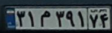
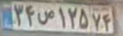
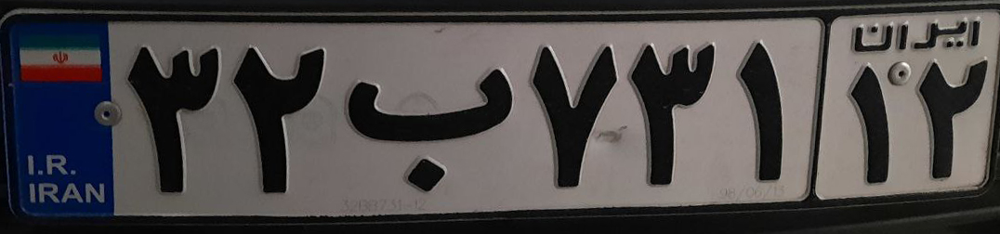
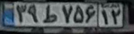

# Persian License Plate Text Recognition with using Deep Text Recognition Benchmark

## Description

◻️ Use [deep-text-recognition-benchmark]([(https://github.com/clovaai/deep-text-recognition-benchmark)https://github.com/clovaai/deep-text-recognition-benchmark])
repository  to recognize persian license plate text

◻️ Use [IR-LPR]([(https://github.com/mut-deep/IR-LPR)https://github.com/mut-deep/IR-LPR]) for dataset train and validation 

## How to install
```
pip insatll -r requirements.txt
```

## How to run
1- Convert xml to txt
```
python xml2txt.py
```
2- Train dataset 
```
python DTRB.ipynb
```

## Results

| Iteration       |  Train Loss     | Valid Loss      | Best Accuracy  |
| -------         | ---             | ---             |---             |
| 6000            |    0.00275      | 0.58445         | 81.212         |


|  |  | |
 |
| :-------------------:                    | :-----------------------: | :-------------:                   | :---------------:                            |
|  31m39174                               |   34u12574             |   32b73112            |  39r75612                      |
|  m =  م                                  |   u = ص              |   b = ب               |  r=  ط                         |
